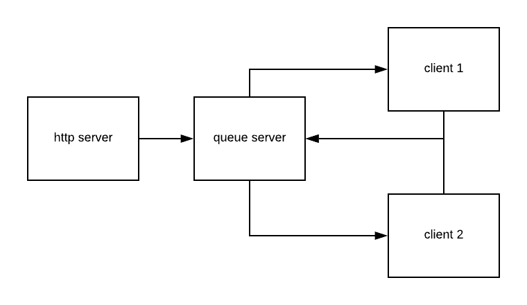

# LAB - 19 

## Code Fellows Parcel Delivery Service

### Author: Student/Group Name

### Links and Resources
* [submission PR](https://github.com/david-vloedman-401-advanced-javascript/401-lab-19/pull/1)
* [travis](https://www.travis-ci.com/david-vloedman-401-advanced-javascript/401-lab-19)

#### Documentation

* [JSDocs](./docs/index.html)

### Setup

#### How to initialize/run your server app (where applicable)

* node cfps-server.js
* node app.js
* node flowers-r-us.js
* node acme-widgets.js

  
#### Tests

* 'npm test'

#### UML

